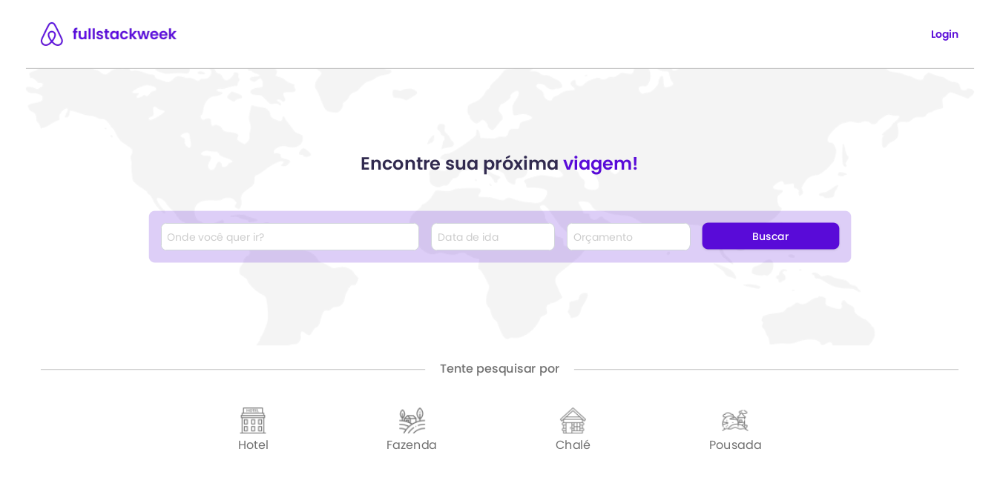

<p align="center">
  
</p>

<p align="center">
  
</p>

## Deploy: https://fsw-trips-olive.vercel.app

## 💻 Projeto


Este site proporciona aos seus utilizadores uma experiência abrangente para planear viagens e alojamento em hotéis. As funcionalidades incluem a pesquisa de hotéis, a visualização de informações detalhadas sobre os estabelecimentos e a reserva de quartos. É uma solução completa para aqueles que pretendem descobrir novos destinos e encontrar alojamentos ideais.

<p align="center">
   
</p>

## Funcionalidades
- Buscar viagens
	- Por localização, por data inicial, orçamento máximo.

- Ver detalhes de uma viangem
	- Fotos(4), descrição da viagem, ver foto principal, destaques, preço por noite, data, hóspedes.

- Reservar uma viagem
	- Garantir que a data selecionada não foi reservada por outro usuário.
	- Garantir que número máximo de hóspedes seja respeitado.

- Ver viagens reservadas
 	- Pegar viagens do usúario

- Cancelar essas viagem
	- Ao cancelar uma viagem, data precisa ficar disponivel novamente.


## Páginas da aplicação
- /: Página inicial com lista de viagens e botão para login do usuário.
- /trips/[id]: Uma página com detalhes da viagem.
- /trips/[id]/confirmation: Uma página com detalhes da viagem e confirmação da reserva.
- /checkout/stripe: Uma página com checkout de pagamento.
- /my-trips: Uma página com as reservas do usuário.

## 🧪 Tecnologias Utilizadas

Esse projeto foi desenvolvido com as seguintes tecnologias:

[](https://skillicons.dev)

## 🚀 Como executar

```bash
# Clone este repositório
$ https://github.com/LeonardoCD/fsw-trips.git

# Entre na pasta
$ cd fsw-trips

# Instale as dependências
$ npm install

# Execute a aplicação em modo de desenvolvimento
$ npm run dev

# A aplicação inciará na porta:3000
acesse <http://localhost:3000>
```

## 📝 Licença

Esse projeto está sob a licença MIT. Veja o arquivo [LICENSE](LICENSE) para mais detalhes.
